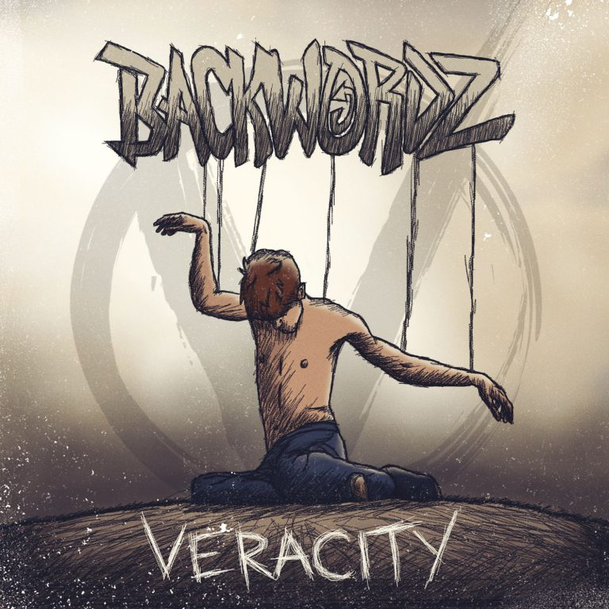
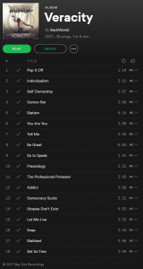

# BackWordz – Veracity

BackWordz er et relativt nytt musikkband som produserer anarko-kapitalistisk hip hop/metal. De har frem til nå gitt ut flere gode singeler, men endelig er deres første album ute, nemlig Veracity!

Ut fra tittelene på sangene, er det ganske åpenbart for noen som allerede kjenner til anarko-kapitalisme som filosofi, men for andre som oppdager BackWordz for deres musikk, vil nok lære noe nytt som «Praxeology» og ikke minst om man følger med på tekstene, har de et budskap som er noe annet enn hva de fleste andre artister har.

Kort lite utdrag fra sangen «Self Ownership»:

*Y’all supported Bernie, that didn’t work to well, did it though? Funneling millions to his campaign
Swore he wasn’t a crook until he endorsed the same thing
Then you support the lesser of the evil fakers
But it just repeats and we revisit this 4 years later
The State itself is based on theft and can’t be fixed
So realize you own yourself & no one else – BackWordz*

Album er [tilgjengelig på Spotify](https://open.spotify.com/album/3AttuhLTu56BWofzifAzZv), men du finner det også på YouTube om du søker der.