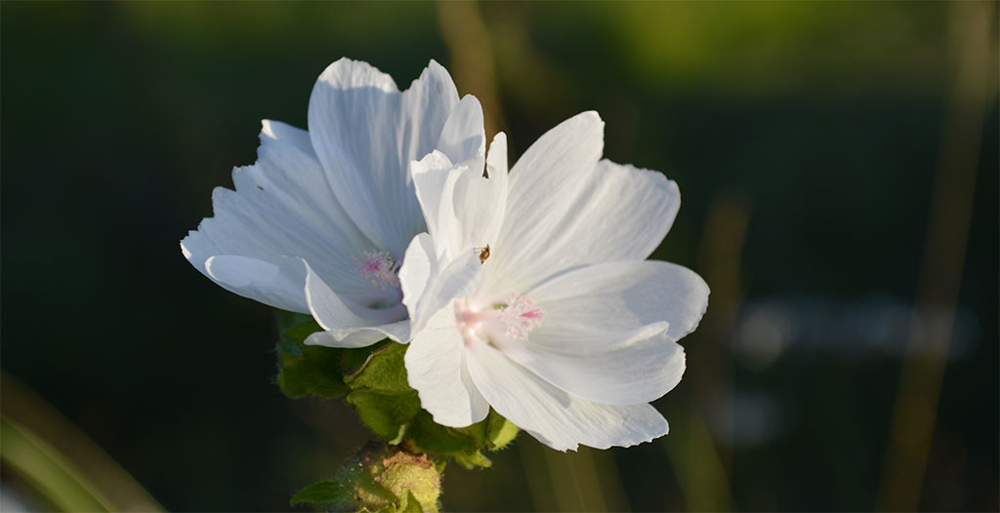

# Frihet i ditt liv

#### 21. september 2015 | Sondre Bjellås

Et gjennomgående budskap i tekstene på utenstat.no, er å skape forandring og forbedring i ditt eget liv.

Å følge sin personlige moralske overbevisning er en utrolig effektiv og suksessfull metode for å få et bedre liv. Personlig har jeg opplevd enorm forbedring av mental form, gjennom å distansere meg fra det jeg mener er galt og umoralsk.

Det er nok et generelt råd som er bra å følge, å unngå handlinger og situasjoner som går mot de personlige moralske overbevisningene man har. For min del, går dette ut på å følge [ikke-aggresjons-prinsippet](/ikke-aggresjons-prinsippet/) og distansere meg selv mest mulig fra offentlig og politisk maktbruk.

Livet er for alle oss, veldig kostbart og kortvarig. Vi har kapasitet for rasjonelle tankeprosesser, og vi forstår hvor viktig det er å fokusere energi og krefter på områder man faktisk kan skape en forskjell og forbedring.

## Hva man kan gjøre

Selv de minste endringene kan gi en oppløftende effekt, det kan være så enkelt som å begynne med egen kompost av matavfall og avfall fra hagen (f.eks. gress som klippes). Fremfor å la seg bli tvunget til å betale offentlig renovasjon for å hente ditt matavfall, kan man unngå å betale de pengene ved å kompostere på egenhånd.

Effekten av dette er at man sparer penger, man bidrar med mindre midler til det offentlige. Man sparer også ved å produsere egen jord, fremfor å måtte kjøpe den. Jord man kjøper i butikken er i mange tilfeller tatt fra myrer som blir ødelagt, som igjen ødelegger bomiljøet til mange dyr.

Det finnes hundrevis av slike små tiltak man kan gjøre i hverdagen, som gjør at man har mindre med det offentlige å gjøre. Det er ikke uten grunn at mange mennesker blir nedbrutte og syke av å forholde seg til offentlige etater som NAV.

Hvis man er en sosialdemokrat og elsker sosialisme, kan det godt være slik  at man får mer lykke av å bruke offentlige tjenester og muligheter så langt det er mulig. For meg er det motsatte en virkelighet, da jeg har en moralsk overbevisning om at fred, frihet og frivillighet er viktige moralske prinsipper.

Andre tiltak er å [dyrke sin egen mat](/drivhus-2013/), gjøre seg selv og familien mer uavhengig, samt spare penger, redusere behovet for inntekt. Man kan vurdere å [bli veganer](/veganisme/), som vil dramatisk redusere avhengighet på naturlige ressurser ikke minst reduksjon av vold, utnyttelse og drap på dyr.

## Hva man ikke bør gjøre

Hvis man tenker rasjonelt og logisk, bør man etterhvert komme til en konklusjon om at det å forandre samfunnet i strid med hva de fleste andre ønsker, ikke er realistisk eller mulig å oppnå.

Man bør derfor ikke engasjere seg politisk. Man bør ikke etablere sitt eget politisk parti. Man bør ikke gå på kompromiss av egen moral for å kunne bidra og delta i politiske partier som er mest lik sin egen overbevisning, nettopp fordi dette vil være destruktivt for din egen helse.

Du bør unngå å falle for illusjonen om å tro at man kan oppnå politisk makt til å kunne utgjøre en reell forandring og forbedring.

## Veien videre

Veien videre for oss som tror på fred, frihet og frivillighet, som et godt fundament for samfunnet, er ikke å forandre det samfunnet som består av alle andre. Veien videre må være å etablere våre egne samfunn, hvor vi kan følge våre overbevisninger om hva som er rett og galt.

Vi kommer ikke til å få muligheten til å etablere egne fullstendig isolerte samfunn, vi vil alltid måtte leve under makten til staten og majoriteten. Det er dem som dikterer overordnede lover og regler, men innenfor dette lovverket er det mange frihet og muligheter. Det er nettopp disse frihetene og mulighetene man må leve fullt ut.

Disse samfunnene eksisterer allerede mange steder rundt i den virkelige verden, og enda mer i den digitale verden. Det skjer spennende utvikling på flere slike prosjekter, som jeg vil følge opp her fremover i tiden.

Vær trygg, vær glad, lev livet!