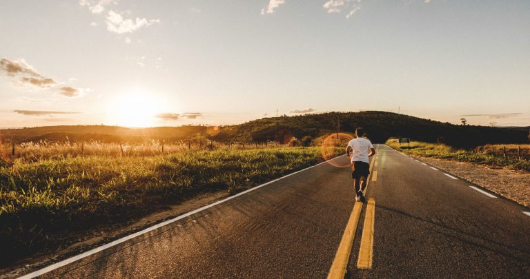
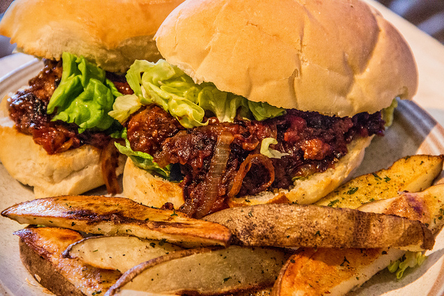

# Kan vi skape et frivillig samfunn?

<h2 class="highlight">Bloggen er etablert for å få igang en diskusjon om moral, filosofi, politikk og frihet.</h2>

<!-- This structure is easier to just do with HTML. URLs won't be parsed as this is HTML, so we have to manually link to .html and not .md -->
<a class="post" href="kommer-vi-videre">
    

    

        <h3>Kommer vi videre?</h3>
        
Nå har det vært over to år siden sist innlegg her på siden, og har vi kommet noe videre med mer frihet?

        
10. juni 2019

    

</a>

<a class="post" href="backwordz-veracity">
    

    

        <h3>BackWordz – Veracity</h3>
        
BackWordz er et relativt nytt musikkband som produserer anarko-kapitalistisk hip hop/metal.

        
20. april 2017

    

</a>

<a class="post" href="mennesket-og-intelligens">
    

    

        <h3>Mennesket og intelligens</h3>
        
Mennesket er et fantastisk dyr, og vi har en enorm kapasitet for intelligens.

        
20. november 2016

    

</a>

<a class="post" href="kritisk-tenkning">
    

    

        <h3>Kritisk tenkning</h3>
        
Kritisk tenkning er ikke noe som kommer naturlig, man må jobbe og forbruke energi for å opprettholde det kritiske tankesettet.

        
12. november 2016

    

</a>

<a class="post" href="liberstad-et-lite-stykke-frihet">
    

    

        <h3>Liberstad – et lite stykke frihet</h3>
        
Liberstad er en prosjektert privat by som vil bli etablert i Sør-Norge.

        
24. september 2016

    

</a>

<a class="post" href="nar-bias-tar-overhand">
    

    

        <h3>Når bias tar overhånd</h3>
        
Jeg har lenge tenkt å skrive litt om vitenskap, skepsis og hvordan vitenskapelige begrep og ord, ofte blir misbrukt til å forlede oss inn i vranglære.

        
8. oktober 2015

    

</a>

<a class="post" href="frihet-i-ditt-liv">
    

    

        <h3>Frihet i ditt liv</h3>
        
Et gjennomgående budskap i tekstene på utenstat.no, er å skape forandring og forbedring i ditt eget liv.

        
21. september 2015

    

</a>

<a class="post" href="slik-fungerer-hjernen">
    

    

        <h3>Slik fungerer hjernen</h3>
        
Hvis man gjør et søk på nettet etter «slik fungerer hjernen» eller «hvordan virker hjernen?» så er det ganske triste greier som kommer opp som resultat.

        
25. juli 2015

    

</a>

<a class="post" href="anarkisme-er-ikke-liberalisme">
    

    

        <h3>Anarkisme er ikke liberalisme</h3>
        
Det er ikke slik at anarkisme er en høyre-orientert politikk eller har noen særlig relasjon med liberalisme. 

        
8. mars 2015

    

</a>

<a class="post" href="veganisme">
    

    

        <h3>Veganisme</h3>
        
Et menneske som står for ikke-aggresjons-prinsippet, at ingen skal initiere vold og makt mot andre mennesker mot deres vilje, bør tenke seg grunnleggende om hvorfor prinsippet kun skal være gjeldende for samhandling mellom andre mennesker, og ikke samtidig gjelde for andre dyr.

        
18. februar 2015

    

</a>

<a class="post" href="selvsagt-har-vi-ikke-fri-vilje">
    

    

        <h3>Selvsagt har vi ikke fri vilje</h3>
        
Vet du hvorfor vann noen ganger blir omtalt som H2O? Fordi vann er en molekylær binding av to hydrogen-atomer og ett oksygen atom.

        
13. februar 2015

    

</a>

<a class="post" href="stemningsbilder-fra-gaza">
    

    

        <h3>Stemningsbilder fra Gaza</h3>
        
Alle medier har en agenda, også bloggere. Jeg har en agenda med denne bloggen, og det er å spre informasjon og budskap om ikke-voldelig og frivillighets-basert samhold mellom mennesker.

        
13. august 2014

    

</a>
