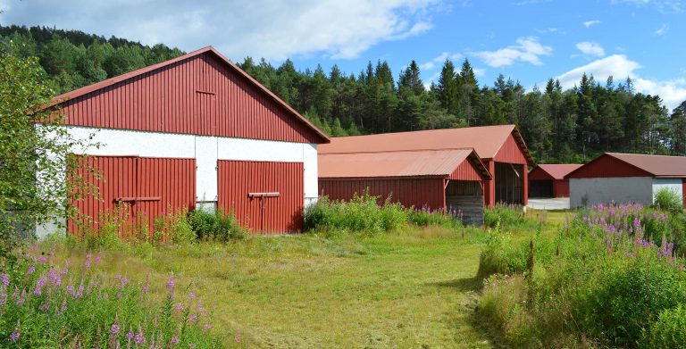

# Liberstad – et lite stykke frihet

#### 24. september 2016 | Sondre Bjellås

Rundt omkring i verden finnes det flere gode og spennende prosjekter for å etablere mer fri og liberale byer, områder og land. Et av de mest kjente i nyere tid er [Liberland](https://en.wikipedia.org/wiki/Liberland), som jobber med å få etablert en ny stat. [Fort Galt](http://www.fortgalt.com/) er det mindre prosjekt, som kom ut av [Galt’s Gulch Chile](http://galtsgulchchile.com/), etter det prosjektet fikk problemer. Det er viktig lærdom å ta med seg fra alle disse prosjektene rundt i verden, og andvende denne til å gjøre ting bedre og bedre i tiden fremover.

Liberstad er en prosjektert privat by som vil bli etablert i Sør-Norge. Det er snakk om en privat by, ikke en ny og uavhengig stat.

Formålet med Liberstad er å starte å etablere et sted som kan vokse til å kunne dekke alle tjenester og behov som befolkningen der trenger, gjennom private og frivillige avtaler. Det betyr at man ikke vil ha kommunale tjenester, som vann og renovasjon.

Ettersom Liberstad etableres som en by i et eksisterende land, vil man måtte forholde seg til det eksisterende lovverket som ligger til grunne. Det er likevel flere friheter innenfor det eksisterende lovverket som man kan benytte til å øke sin personlige frihet. Det er flere fordeler med dette, spesielt med tanke på gjennomføringsevnen. Hvis Liberstad får suksess og vokser, vil byen kunne bli et eksempel for andre og ikke minst, kunne bidra til fornyelse og endring av eksisterende lovverk.

Initiativtakere bak Liberstad er John og meg selv, vi er begge voluntaryister og har tror på muligheten for å etablere et samfunn grunnlagt på frivillige og fredelige avtaler.

Prosjektet har nå holdt på i litt over ett år og forhåndssalget av hyttetomter i byen er i gang. Det er valgt å gjennomføre oppkjøpet av tomten gjennom forhåndssalg, av grunner som, at vi ønsker å se hvorvidt det er et marked for et slikt sted i Norge.

Det er en selvfølge at det vil bo og komme mennesker av en rekke ulike politiske ideologier og livsfilosofier, men det som vil være felles for de alle er troen på og oppfølging av ikke-aggresjons-prinsippet, at ingen har rett til å initiere tvang ovenfor noen andre, bortsett ved akutt behov for selvforsvar.

Forhåndssalget av tomter startet i august, og avsluttes i oktober. På nåværende tidspunkt har det blitt forhåndssolgt hele 75 av 150 mål som er lagt ut for salg i denne runden. Dette er en utmerket mulighet til å anskaffe seg en veldig billig hyttetomt.

For 35.000,- vil du kunne få kjøpt en tomt i vakre og idylliske Liberstad, som ligger nord i Marnadal Kommune i Vest Agder.

[Hjemmesiden til Liberstad](http://www.liberstad.no/) har en overflod av informasjon, undersøk den gjerne og lær mer om den prosjekterte byen. Spørsmål kan du stille på e-post eller på [Facebook](https://www.facebook.com/liberstad/). Jeg tar selvsagt spørsmål på bloggen her også.

Om du selv ikke har mulighet til å kjøpe tomt i dette spennende prosjektet, håper jeg du kan spre informasjon om Liberstad og kanskje bidra med at andre som ikke vet om det enda, får muligheten til å lære mer om [ikke-aggresjons-prinsippet](/ikke-aggresjons-prinsippet/), voluntaryism, anarko-kapitalisme og private og frie byer.

Informasjonen er også tilgjengelig på engelsk, hvis du har noen venner som ikke leser norsk:

Engelsk hjemmeside:
http://www.liberstad.com/

Engelsk facebook-side:
https://www.facebook.com/liberstad.english/