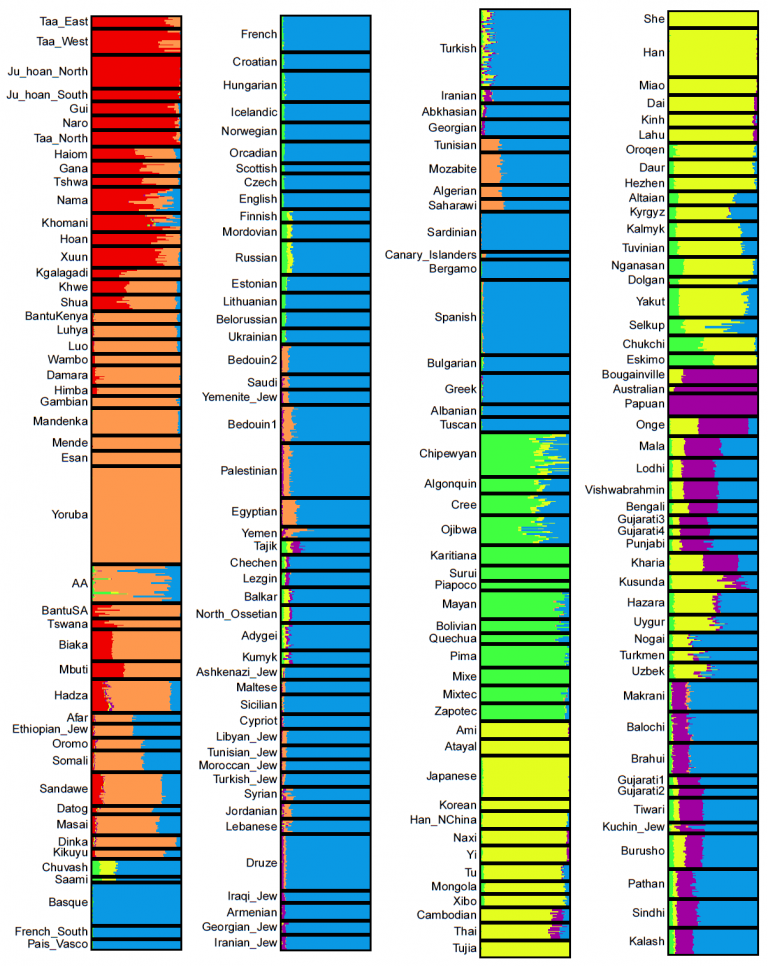
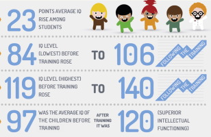

# Mennesket og intelligens

#### 20. april 2017 | Sondre Bjellås

Mennesket er et fantastisk dyr, og vi har en enorm kapasitet for intelligens. Dessverre er det noen mennesker der ute, som forsøker å spre misinformasjon og løgner om andre mennesker. Dette er en slags oppfølging til mitt forrige innlegg om [kritisk tenkning](/kritisk-tenkning/).

## Hva er IQ?

IQ er nivået man får ved å gjennomføre en IQ-test. Resultatet av en IQ-test utgjør en hypotese om intelligensnivået til et individ.

For at en IQ-test skal være så god som mulig, er det viktig at den blir foretatt av kvalifisert personell og under optimale forhold. Richard Lynn er en av de som bryter med dette, og konsekvent bruker resultater fra mennesker som for eksempel har malaria. Ulike malaria kan gir mildere og mer langvarige sykdomsforløp, andre er farligere. Det som er kjent, er at sykdom som malaria reduserer nivået som et individ får på en IQ-test.

IQ er en av flere måter vi har i dag for å måle intelligens hos mennesker, men det største problemet med IQ er at den blir misbrukt i forsøk på å utlede ny kunnskap basert på individuelle tall.

Forskjell på intelligens blant mennesker, er en selvfølge. Individuell intelligens er et resultat av genetisk arv, og miljø.

Det er i utgangspunktet ikke noe galt med slik kunnskap, men det blir misbrukt av mange, og det er de som faktisk er smarte og forstår, men som bruker informasjon til å mislede andre, fordi det er ikke alltid like lett å forstå. Jeg vil forsøke å oppklare litt med dette innlegget.

## Standardavvik

Fra tid til annen, vil du kunne lese om intelligens og IQ (intelligenskvotient) i norske medier, og ikke minst på norske bloggere og i diskusjoner i sosiale medier. Felles for mange av disse, er at de er misvisende og feilinformerende. Noen ganger bruker de dårlige kilder, andre ganger gir de konklusjoner basert på data som de ikke har grunnlag for å gi, og andre ganger er det forvirring og misforståelser.

Vi har eksempler hvor journalister har brukt resultater med ulike standardavvik (SD) og presentert disse opp mot hverandre. Pr. i dag er det SD 15 som blir mest brukt, men jeg poengterer dette fordi det finnes eksempler hvor SD 24 verdier blir sammenlignet med SD 15 verdier, ofte når Albert Einstein sammenlignes med noen andre.

Kort fortalt så er det hvor stor spredning, eller avstand, man skal telle fra gjennomsnittet (eller midtpunktet) som er på 100. Hvis man benytter SD 15, er det kortere avstand mellom tallene, benytter man SD 24 er det høyere avstand.

Det betyr at en IQ på 180 med SD 24, er det samme som IQ på 150 med SD 15.

Dette var bare til opplysning for at du selv skal unngå misforståelse når du leser eller kommuniserer, resten av teksten har ingenting med SD å gjøre.

## Menneskets historie og gener

Menneskets historie er lang og kompleks, vi stammer alle fra Afrika og har reist ut i verden i forskjellige mønster. Over lang tid, har vi fått noen inndelinger av gener som blir brukt til å avklare opphav til ulike trekk ved individer og folkegrupper, disse blir gjerne kalt for raser av dem som ikke driver forskning innenfor genetisk drift og evolusjon. De som fortsatt benytter begrepet rase, gjør det gjerne på samme måte som vi beskriver hunderaser, mens det også tradisjonelt har blitt brukt til rasediskriminering.  Mennesket (homo sapiens) er en art primater i familien [menneskeaper](https://no.wikipedia.org/wiki/Menneskeaper).

Den aller siste store splitten som forekom, var den mongoloide rase.

Det skjer stadig utvikling innenfor disse gruppene og klassifiseringer, ulike antropologer har ulike meninger og ønsker endringer. Det viktigste er bare at man forstår at dette ikke er noen eksakt vitenskap. De inndelingene som har vært laget, er i stor del subjektive inndelinger basert på beskrivelser av utseende til ulike folkegrupper. Forskjellen mellom mennesker er ikke høy, og vi deler alle 99,99999% av våre gener.

Carleton Coon innførte i 1962 en inndeling som tok utgangspunkt i 5 raser og er mye brukt i dag, mens diagrammet nedenfor inkluderer også «Native Americans»/Den amerikoide rase. Disse splitter igjen videre ned til flere klassifiseringer.

* [Den kapoide rasen](https://no.wikipedia.org/wiki/Den_kapoide_rasen) (rød)
* [Den negroid rase](https://no.wikipedia.org/wiki/Den_kongoide_rasen) (orange)
* [Den kaukasoide rasen](https://no.wikipedia.org/wiki/Den_kaukasoide_rasen) (blå)
* [Den mongoloide rase](https://no.wikipedia.org/wiki/Den_mongoloide_rasen) (gul)
* [Den australoide rase](https://no.wikipedia.org/wiki/Den_australoide_rasen) (lilla)
* Den amerikoide rase (grønn)

Kilde: [Global Admixture Analysis at K=6](http://racialreality.blogspot.no/2013/12/global-admixture-analysis-at-k6.html)

Hvis dette er et emne som interesserer deg, vil jeg bare nevne at det finnes [publikasjon fra 2009](http://journals.plos.org/plosone/article?id=10.1371/journal.pone.0007888) som har benyttet nesten 1 million [SNPer](https://en.wikipedia.org/wiki/Single-nucleotide_polymorphism), [en fra 2008](https://www.indigenouspeople.net/HGDP.pdf) som benyttet 600.000 SNPer, og kom opp med 7 distinkte grupperinger. Den analysen ovenfor, er gjort over 300.000 SNPer.

## Richard Lynn

Richard Lynn er et navn som går igjen når det kommer til IQ-nivåer og spesielt da med tanke på nasjonale IQ-nivåer. Det er en grunn til at det ikke er spesielt mange andre kilder for nasjonale IQ sammenligninger, nettopp fordi det ikke er enkelt eller faktisk mulig å komme opp med noen fullverdig og god sammenligning på tvers av land, når det kommer til for eksempel IQ-nivået.

Richard Lynn har utgitt flere bøker og publikasjoner, som samtlige har fått gjentatte negative fagfellevurdering (peer-reviews) som viser flere feil og alvorlige utfordringer med hvordan Lynn og de andre han har samarbeidet med jobber.

Det som dessverre skjer da, ettersom det er meningsløst og tilnærmet umulig å gjøre god vitenskap ut av sammenligning av intelligens på tvers av nasjoner, er at det ikke kommer noen andre kilder enn Richard Lynn. Da blir han referert til gang på gang, også av andre forskere som gjør meta-analyser av Richard Lynns eksisterende analyser av andres tall. De fleste som refererer til Lynn på overordnet nivå, har nok ikke engang fått med seg hvordan Lynn benytter ekstrapoleringer av nasjonale IQ-nivåer i land hvor han mangler IQ-tester.

Lynn har, som vist gjennom flere fagfellevurderinger av hans publikasjoner, gjort usystematisk utvelgelse av datagrunnlaget for sine konklusjoner. Eksempelvis påstår Lynn og Vanhanen (2006) at nasjonal IQ for Nigeria er 69, mens hvis annet tilgjengelig datagrunnlag blir brukt, er gjennomsnittet mye høyere enn 70.

Lynn og Vanhanen har ekskludert flere datakilder i sitt arbeid, uten å gi noen forklaring på hvorfor.

Et annet eksempel på selektiv utvelgelse er for Nigeria, hvor det eksisterte data for 5 ulike tester tilgjengelig gjort med barn. Lynn og Vanhanen ekskluderte de 3 med høyeste IQ-resultat, og benyttet kun de to laveste. De valgte også å forkaste resultater fra Sør-Afrika som ville gitt høyere gjennomsnitt.

Fagfellevurderinger:

[«Academic Racism: Lynn‘s and Kanazawa‘s Ill-considered  Theory of Racial Differences in Intelligence»](http://edrev.asu.edu/index.php/ER/article/viewFile/1447/116)

[«A systematic literature review of the average IQ of sub-Saharan Africans»](http://www.sciencedirect.com/science/article/pii/S0160289609000634)

[«The dangers of unsystematic selection methods and the representativeness of 46 samples of African test-takers»](http://www.sciencedirect.com/science/article/pii/S0160289609001470)

[«Another failure to replicate Lynn’s estimate of the average IQ of sub-Saharan Africans»](http://www.sciencedirect.com/science/article/pii/S104160801000035X)

[«Raven’s test performance of sub-Saharan Africans: Average performance, psychometric properties, and the Flynn Effect»](http://www.sciencedirect.com/science/article/pii/S1041608009001071)

Konklusjonen fra denne publikasjonen står som følger:

*«Our review of the literature on the performance of Africans on the Raven’s tests showed that the average IQ of Africans on the Raven’s tests is lower than the average IQ in western countries. However, the average IQ of Africans is not as low as Lynn (and Vanhanen) and Malloy (2008) maintained. The majority of studies on IQ test performance of Africans not taken into account by Lynn (and Vanhanen) and Malloy showed considerably higher average IQs than the studies that they did review. We judge the reviews of Lynn (and Vanhanen) and Malloy to be unsystematic. These authors missed a large part of the literature on IQ testing in Africa, failed to explicate their inclusion and exclusion criteria, and made downward errors in the conversion of raw scores to IQs (Wicherts, 2007). Lynn (and Vanhanen)’s estimate of average IQ of Africans of around 67 is untenable. Our review indicates that it is about 78 (UK norms) or 80 (US norms). These means are somewhat lower than the means of Africans on other IQ tests, which lie around 82 (Wicherts et al., 2010). These results undermine evolutionary theories of race differences in intelligence of Lynn (2006), Rushton (2000), and Kanazawa (2004) (Wicherts, Borsboom, & Dolan, 2010a; Wicherts et al., 2010b).»*

(Hvis du ønsker å lese innholdet i disse publikasjonene, kan du bare kopiere tittelen inn i en søkemotor og så finner du sannsynligvis en PDF kopi. Noen av lenkene går til fulle publikasjoner, andre til abstrakter.)

## Hva gjør det vanskelig?

Det som gjør det vanskelig å lage sammenlignbare nasjonale IQ-nivåer er at det er så mange faktorer som påvirker intelligensen, men hva som forårsaker nivået av IQ er uansett irrelevant, det som er relevant er at man må gjøre en god seleksjon av datagrunnlaget slik at man ikke får skjevheter ved å velge et dårlig datagrunnlag.

Hvis man fra Norge tok IQ test av bare individer som har fullført universitetsutdannelse, mens man i Sverige tok IQ test av bare individer som har fullført barneskolen, ville dette ikke gitt et godt representativt bilde av en gjennomsnitts nasjonal IQ i verken Norge eller i Sverige. Verdiene ville også vært meningsløse å sammenligne med hverandre.

Det betyr derimot ikke at gjennomsnittsnivået fra hvert land ikke er fakta. Men det er ikke mulig å få ny innsikt ved å sammenligne disse to målingene på tvers av nasjoner. Det er dette som er essensielt å forstå, og gjør man ikke det, går man i en felle hvor man benytter denne informasjonen til å dømme andre basert på deres tilhørighet til ulike folkegrupper.

## Afrika

Mens det er flere utfordringer med Lynn og hans publikasjoner, er det verste problemet med Afrika og påstand om et Afrika ligger på et gjennomsnittsnivå på 70 eller lavere.

Det er mer riktig å påstå at nivået ligger på 78-80, som jeg har referert til med kilder ovenfor i teksten min.

De fleste forskere er enige at gjennomsnittsnivået av IQ i mange land i Afrika er lavere enn en god del andre land, men dette har helt naturlige forklaringer og svaret ligger ikke bare i genene. Hvis behovet for intelligens i samfunnet er lavere, vil det falle naturlig og svekkes. Når behovet for høyere intelligens i samfunnet er større, vil det økes gjennom mer utdannelse og arbeidsoppgaver og stillinger som stimulerer og øker intelligens.

Dette er kjent som [Flynn-effekten](https://en.wikipedia.org/wiki/Flynn_effect).

Denne forandringen av gjennomsnittlig intelligens, er altså drevet av flere miljøfaktorer. Den viktigste er fattigdom. Lynn sin konklusjon er at IQ er faktoren som driver fattigdom, eller suksess, men hans konklusjoner er basert på et datagrunnlag som ikke er virkelig eller reelt, og er dermed ugyldige.

God forskning viser at nasjonale IQ-nivåer er drevet av økonomien, ikke motsatt.

Kilde: [«Does the intelligence of populations determine the wealth of nations?»](http://www.sciencedirect.com/science/article/pii/S1053535713000991)

*«Present-day sub-Saharan Africa is one of the poorest regions in the world and the home to some of the world’s most deprived children. The majority of sub-Saharan children are chronically malnourished, not only from lack of food but particularly from food lacking vital elements related to both physical growth and intellectual development. It has been estimated that up to 70 percent of rural children live in absolute poverty and 90 percent suffer severe deprivation.» – (Gordon, Nancy, Pantazis, Pemberton, & Townsend, 2003). Kilde: «Raven’s test performance of sub-Saharan Africans: Average performance, psychometric properties, and the Flynn Effect»*

## Fattigdom gjør deg dum?

Hvis du er fattig, vil kroppen og hodet ditt bruke mye mer energi på utfordringer og bekymringer i forhold til dette, og man har dermed mindre kapasitet og energi tilgjengelig for andre formål, som vi i Norge har mulighet til å utforske og bruke våre tid på. Dette i følge [forskning gjort av Princeton University](https://www.princeton.edu/main/news/archive/S37/75/69M50/index.xml).

Dette betyr at fattige, vil fortsette å være fattige, fordi de vil gjøre feil og dårlige avgjørelser som forsterker og viderefører, deres økonomisk dårlige situasjon.

De som sverger til Lynn og hans dårlige forskning, tror og mener at fattige er fattige fordi de er genetisk disponert til å være mindre intelligente og har lavere IQ-nivå. At de dermed aldri vil klare å komme ut av fattigdom.

God forskning viser oss at dette er feil, at det er vanskelig å komme ut av fattigdom og at fattigdom er førende for intelligens.

Fra rapporten til Princeton University:

*«On average, a person preoccupied with money problems exhibited a drop in cognitive function similar to a 13-point dip in IQ»*

Her er en annen forskningsrapport som avdekker det samme:

[«Poverty Impedes Cognitive Function»](http://science.sciencemag.org/content/341/6149/976)

## Intelligens kan trenes

Det finnes mange ulike forskere som vil gi deg ulike tall på hvor mye genetisk arv har å si for intelligens, og hvor mye som er miljø. Det vi definitivt vet, er at miljø er en viktig faktor. Alt fra mangel på kjærlighet og varme som barn, til feilernæring, påvirker vår intelligens i tidlig alder og gjennom hele livet.

Mange er kanskje ikke klar over det, men fedme og overvekt påvirker resultatet på IQ-tester. Dette har ført til at det finnes flere undersøkelser som avdekker at [vegeterianere og veganere har gjennomsnittlig høyere IQ-nivå](https://www.psychologytoday.com/blog/the-scientific-fundamentalist/201005/why-vegetarians-are-more-intelligent-meat-eaters) enn andre.

Utdannelse er et annet viktig instrument for å øke intelligens, og dermed også IQ-nivået i tester. Dette har blitt demonstrert ganske konsekvent og godt i blant annet Norge, hvor det har blitt synlig endring etter forandring i det offentlige skolesystemet.

En undersøkelse som viser dramatisk økning i IQ-nivå, er denne publikasjonen:

[«A relational frame skills training intervention to increase general intelligence and scholastic aptitude»](http://www.sciencedirect.com/science/article/pii/S1041608016300231)

Grafikken nedenfor oppsummerer raskt resultatet fra trening:

Dere kan jo selv lese hvor enorm forskjell det resulterte i, men det mest interessante er hvordan det laveste nivået før treningen var 84, og endte opp på 106 etter trening.

## Mennesket som individ

Som tilhenger av individuell frihet, mener jeg det er viktig at man anser ett hvert menneske som individ og med den kapasiteten de har.

Det er derimot politiske krefter og andre krefter i samfunnet, som ønsker å bruke makt og politikk til å bestemme hvem som skal få lov til å bevege seg fritt, eller ikke. Disse benytter gjerne dårlig forskning som noe av det Lynn har produsert, til å støtte sine ønsker.

Ved å spre generaliserte opplysninger om folkegrupper, vil man bygge opp en naturlig fremmedfrykt som hver av oss har. Hvis unge mennesker blir presentert med «vitenskap» om at mennesker fra for eksempel Syria har så lav IQ at de gjennomsnittlig kan likestilles med noen som har Downs Syndrom, så vil det kunne få konsekvenser for hvordan disse unge menneskene ser på individer fra Syria. Det er selvsagt ikke faktuelt at IQ-nivået for Syria er så lavt som enkelte påstår, men bare ved å spre slik misinformasjon, så påvirker man mennesker og man påvirker samfunnet.

## Konklusjon

Den konklusjonen jeg ønsker at du skal ta med deg fra denne teksten, er at man i dag ikke har noe godt grunnlag for å gi estimater på nasjonale gjennomsnitt av IQ i mange av verdens land. Mer stabile og utviklede land, som Sverige, Danmark, Norge, Finland, har mer stabile forhold hvor det er mulig å gjøre IQ-tester med betydelig bedre kvalitet enn i en god del ustabile og fattige land i Afrika og Sør-Amerika.

Jeg håper også du forstår det at IQ-nivået i Afrika ikke er så lavt som Richard Lynn påstår, at det ikke er så dårlig stelt som enkelte påstår – og at en av flere årsaker til dette, er fattigdom.

Håper også du innser og ikke tror på påstander om at fattigdom er forårsaket av lav IQ, men at fattigdom forårsaker lav IQ.

Håper du også forstår, selv om jeg ikke gikk spesielt dypt inn på dette, at IQ-nivået vil være lavere over gjennomsnittet hvor behovet er lavere. Det betyr ikke at det er genetiske forskjeller som er resultatet av forskjeller i gjennomsnittlig IQ-nivåer.

Håper du også forstår at vi er alle del av en genetisk arv som har relasjoner på tvers av store folkegrupper, men at vi likevel ikke er så veldig forskjellige og deler majoriteten av våre gener med hverandre.

Man må også huske det at IQ nivået i Europa og verden har økt hvert tiår, sammenligning mellom 1952 og 1982 for militæret i Nederland viser testene tatt i -82 var ca. 20 IQ poeng høyere.

Det er veldig mange kjente faktorer til forbedring av IQ-nivået som fortsatt ikke har forekommet i store deler av Afrika. Flere forskere mener derfor at det er et stort potensiale for Flynn-effekten på nasjonale IQ-nivåer i flere Afrikanske nasjoner.

*«An average IQ around 80 among Africans may appear to be low, but from a historical perspective this average is not low at all. A representative sample of British adults, who took the SPM in 1948 would have an average IQ of 81 in terms of the British norms of 1992 (J. C. Raven, 1960; J. C. Raven et al., 1996). Using older British norms, the average IQ of Africans would be much closer to 100. This is evident in Figure 2, where we compared SPM scores of Africans to older norms. In this figure, the average IQ of several African samples is near or above 100.» – Kilde: «Raven’s test performance of sub-Saharan Africans: Average performance, psychometric properties, and the Flynn Effect»*

Sist, men ikke minst, Richard Lynn er ikke til å stole på. Han har blitt tatt gjentatte ganger for å forfalske og manipulere data til å støtte hans konklusjoner. Noe av dette finner du i fagfellevurderingene jeg har gitt ovenfor, og noen lister jeg her:

[Controversial study of African IQ levels is ‘deeply flawed’](https://www.sciencedaily.com/releases/2010/01/100121155220.htm)

[THE BELL CURVE: INTELLIGENCE AND CLASS STRUCTURE IN AMERICAN LIFE](http://www.mdcbowen.org/p2/rm/sciam1.htm)

[More massaged data from Richard Lynn](http://dienekes.blogspot.no/2006/09/more-massaged-data-from-richard-lynn.html)

Neste gang du blir konfrontert med spørsmål om nasjonale IQ-nivåer, kan du referer til dette innlegget. Ikke minst, husk å alltid vær kritisk og tenk for deg selv, ikke la meg, eller noe andre, avgjøre konklusjonene for deg. Analyser den tilgjengelig data selv, og gjør opp dine egne meninger.