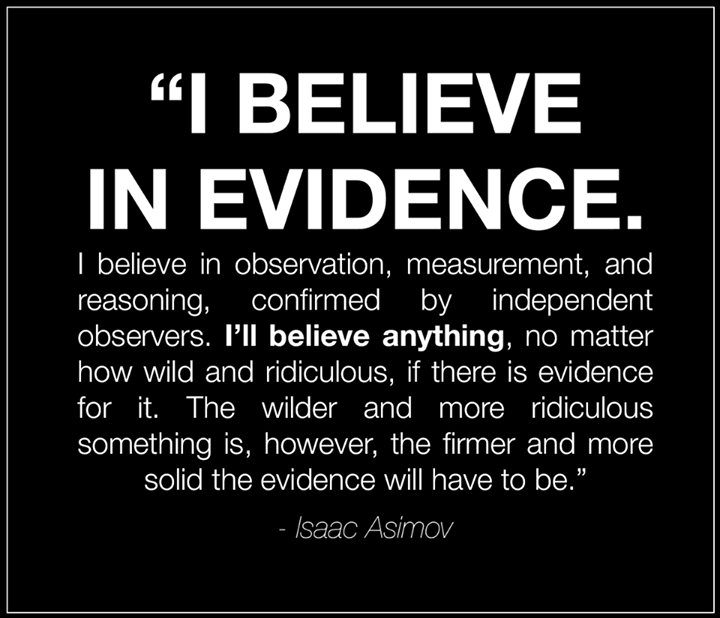
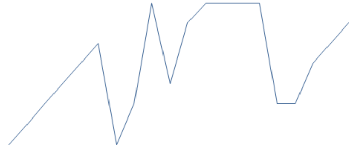

# Når bias tar overhånd

#### 8. oktober 2015 | Sondre Bjellås

Jeg har lenge tenkt å skrive litt om vitenskap, skepsis og hvordan vitenskapelige begrep og ord, ofte blir misbrukt til å forlede oss inn i vranglære. Her vil jeg vise hvordan selv oppegående mennesker, kan falle for egen [bias](https://no.wikipedia.org/wiki/Bias) og ikke forstå hvor man har gått feil.

[Onar Åm](https://no.wikipedia.org/wiki/Onar_%C3%85m) er en norsk forfatter som tidligere har skrevet om klima, og er vel en selverklært skeptiker. Noe av utfordringen derimot å ta budskapet til Onar med god tro, ettersom han har sine mangler når det kommer til vitenskap. Når han viser tydelig manglende evne til kritisk tekning på ett område, vil man få tvil om kompetanse på andre områder. Nå er det selvsagt viktig at man ikke faller for logiske feilslutning å dømme argumentet til noen basert på deres person, eller meninger på andre områder, man bør alltid ta argumentene og analysere dem, ikke gå på person.

Derimot er det ikke til å unngå at man også må ta personligheter i betraktning. Man henvender seg normalt ikke til en snekker, hvis man har tannverk.

Nå kjenner jeg Onar og han er en hyggelig kar, det er ikke med ondsinnet hensikt å velge ham ut av mengden, men han har dessverre satt selv opp i en posisjon som gjør at han passer bra som et eksempel på hvor galt det kan gå.

Vi mennesker har mange mentale feller vi kan gå i, innenfor det man kaller for kvasivitenskap ([pseudovitenskap](https://snl.no/pseudovitenskap)) er det mange mennesker som faller for mange ulike biaser og logiske feilslutninger.

Etter mange diskusjoner med Onar, har jeg erfart at det er flere områder hvor hans meninger ikke har blitt gjennomgått med god nok kritisk sans fra hans side. For å holde innlegget kort, vil jeg fokusere på noe han åpenlyst er en tilhenger av og som han oppriktig tror er et virkelig fenomen.

## Vitenskap og kritisk tenkning

Vitenskapen gir oss en hel rekke verktøy som man kan bruke til å forstå virkeligheten. Det er også mange veier til å finne resultater i vitenskapen, men normalt har man først målinger av ett eller annet fenomen som man undersøker videre for å få en forståelse og forklaring. I noen tilfeller kan man også først ha en konklusjon, og forsøker å finne data og forskning som støtter opp rundt en konklusjon. Dette er fordi en konklusjon kan oppstå i hodet, basert på tanker og man får en idé som potensielt kan være riktig.

Utfordringen er derimot at veldig mange mennesker får konklusjoner som de tror og mener er riktige, før de har gjort godt vitenskapelig arbeid. Fremfor å la data og undersøkelser bygge opp en konklusjon, så bruker man vitenskapelige verktøy og metoder for å finne data og forskning som støtter den apriorisk (fra forhånd) konklusjon.

Når man gjør forskning på denne måten, må man være ekstra flink og benytte god kritisk tekning for å unngå mange bias som våre hoder faller for.

Les blant annet [Observer expectancy effect](https://en.wikipedia.org/wiki/Observer-expectancy_effect) og [Cognitive bias](https://en.wikipedia.org/wiki/Cognitive_bias) for å lære litt mer om de mange feilsteg som gjøres innenfor forskning. Dessverre er den norske siden for disse veldig mangelfulle, noe som er trist ettersom dette er viktige emner å lære om for de som ønsker å bli bedre kritiske tenkere.

For å gå litt mer i dybden og som en god introduksjon til å begynne å bli en bedre kritisk tenker, vil jeg anbefale kurset
[«Your Deceptive Mind: A Scientific Guide to Critical Thinking Skills»](http://www.thegreatcourses.com/courses/your-deceptive-mind-a-scientific-guide-to-critical-thinking-skills.html) ([Audible-link](http://www.audible.com.au/pd/Non-fiction/Your-Deceptive-Mind-A-Scientific-Guide-to-Critical-Thinking-Skills-Audiobook/B00FGA782C)).

Kritisk tekning, logisk tekning, dette er ikke evner man naturlig er født med. Disse må trenes opp gjennom å lære seg om alle de kognitive biasene vi har, forståelse av den vitenskapelige metode og filosofi som helhet.

## Ekstrasensorisk persepsjon

[The Global Consciousness Project](http://global-mind.org/) er et prosjekt som Onar har erklært at han tror på. Han bruker dette som et av flere eksempler på at [ekstrasensorisk persepsjon](https://sml.snl.no/ekstrasensorisk_persepsjon) (ESP) er et virkelig fenomen. Andre kilder han har referert til er en metastudie utført av blant annet [Ben Goertzel](https://en.wikipedia.org/wiki/Ben_Goertzel), en brilliant forsker på kunstig intelligens som Onar jobbet for tidligere, og ikke minst den fantastiske forfatteren  [Damien Broderick](https://en.wikipedia.org/wiki/Damien_Broderick).

Sammen har disse to utgitt en bok som er en såkalt metastudie, det betyr at man sammenstiller resultater fra flere andre studier for å finne ny informasjon i korrelasjoner av resultatene. Mange metastudier er dårlige og det er flere bias, og ikke minst vitenskapelige svakheter, som gjør disse studiene sårbare for feil, mistolkning og usikkerheter.

Feilen som Ben og Damien har gjort i sin bok, Evidence for Psi: Thirteen Empirical Research Reports, er så enkelt som at de har valgt ut forskningsresultater som alle består av selektive statistisk data-mining. Fremfor å se på helheten av vitenskapen som viser at det ikke er noe virkelige fenomen (ESP), har de altså selektivt valgt forskning som støtter opp rundt deres apriorisk antagelse om at ESP er virkelig.

Fremfor å ta hele mengden av all forskning på ESP, som dokumenterer konsekvent og sikkert at det ikke finnes noen fenomen utover vilkårlighet (randomness), så har studiene som metastudien basert seg på, ikke fulgt de nødvendige metodene og teknikkene for god vitenskap.

For å illustrere dette har jeg fort valgt en av undersøkelsene som boken er basert på, Telepathy in Connection with Telephone Calls, Text Messages and E-Mails av [Rupert Sheldrake](https://en.wikipedia.org/wiki/Rupert_Sheldrake) (forfatter av blant annet «The Physics of Angels» og [«The Science Delusion«](https://philosophynow.org/issues/93/The_Science_Delusion_by_Rupert_Sheldrake), les anmeldelsen for å lære litt mer om kvasivitenskapen til Rupert). De har også brukt The Global Conciousness Project, som jeg dypere skal forklare alvorlige feil ved nedenfor.

Du kan selv gjennomføre eksperimentet til Rupert, ved å [gå på denne siden](http://www.sheldrake.org/participate/telephone-telepathy-test). Påstanden er at enkelte mennesker har valgt riktig 45% av gangene (fra en artikkel), mens det statistisk sett kun skal være 25% riktig (1 ut av 4 mulige). Problemene med undersøkelsen til Rupert, er ganske normalt innenfor forskning på ESP. Det er veldig mange faktorer som man må passe seg for og forsøke å utelukke, samt at testen hans har blitt gjennomført på veldig få mennesker.

Her er mer [utdypende om studien](https://www.bial.com/imagem/Bolsa0106.pdf). Hvis den som skal ringe, sende SMS eller e-post blir valgt ut av datamaskinen før personen som skal motta meldingen har gitt en spådom om hvem som sender meldingen, er resultatet vilkårlig (random). Men det som er «fantastisk», er at hvis datamaskinen først velger ut hvem som skal sende meldingen, deretter mottar meldingen fra denne personen, og deretter spør mottakeren om hvem som kommer til å sende svaret (svaret har ikke fysisk blitt videresendt enda), så er det i undersøkelsen med over 400 forsøk på e-post riktig resultat i 41.8% av tilfellene og over telefon med over 1900 forsøk er suksessen på 43%. Dette er faktisk helt utrolig, hvis det er virkelig.

Eksperimentet er så enkelt at det burde være ganske greit for noen andre å replikkere eksperimentet og gjenskape den samme effekten. Kanskje det er noe jeg kommer til å bruke tid på hvis jeg har noe til overs en dag. Utfordringen derimot hvis jeg gjør undersøkelsen og jeg får et resultat som viser at det i lengden er vilkårlig, at det kun er sjanse, så kommer ikke dette til å forandre meningen til Rupert eller til Onar Åm, eller andre som tror på disse fenomen. Om det var 100 forskere rundt i hele verden som replikkerte eksperimentet under egne kontrollerte forhold, og alle disse viser at det ikke er noe annet enn sjanse, så vil dette fortsatt ikke påvirke meningene til de som tror. Dette er et eksempel på bias hos oss mennesker.

Når man jobber med forskning på vilkårlige (random) resultater, vil det alltid komme kluster (cluster) av data og resultater. Dette er normalt og helt forventet. Det er derfor det er viktig å gjennomføre undersøkelser med så mye data og resultater som mulig, slik at man kan gjøre en mer objektiv og riktig konklusjon hvorvidt det er et reelt fenomen som forekommer, eller om det bare er sjanse. Forskning på ESP har forekommet i over 100 år, har ikke enda gitt noen andre resultater enn sjanse. Det eksisterer ingen vitenskapelig eksperimenter som har klart å gjenskape ESP-effekter under kontrollerte forhold.

Dette betyr enten at ESP er utenfor vitenskapen, noe som selvsagt er fullt mulig. Det betyr at vitenskapen aldri vil kunne bevise ESP. Det andre alternativet, er at ESP etter all sannsynlighet ikke er et virkelig fenomen som kan observeres av vitenskapen.

## De negative konsekvensene

Noen av de negative konsekvensene av spredning av denne kvasivitenskapen, er at mange populærvitenskapelige publikasjoner legger ut «forsknings»-resultater uten at de har blitt grundig verifisert og akseptert av andre. Når disse «nye» oppdagelsene blir spredt, vil «kunnskapen» bli tatt opp av millioner av mennesker. Dette bidrar til å spre usannheter og feil blant majoriteten av folket, som igjen bidrar til å ødelegger og redusere vår kritiske sans.

Her er et eksempel på dette: [Study Shows Telepathy May Be Connected to Phone Calls, SMS, Emails](http://www.theepochtimes.com/n3/771606-study-shows-telepathy-may-be-connected-to-phone-calls-sms-emails/). Folk flest har ikke tid eller kapasitet til å undersøke hvor gyldig slike studier er, dette er opp til den vitenskapelige miljøet. Dette er også hvorfor det er viktig å unngå «science by publication», som skjer altfor ofte i disse dager.

Fremfor å få verifisert hva man observerer og få gjenskapt resultater, har forskere en tendens til å noen ganger publisere resultater før de har blitt gjennomgått av andre. Når det i ettertid viser seg at man har gjort feil, har skaden allerede skjedd.

Ett veldig godt eksempel på dette, er publikasjon av Martin Fleischmann og Stanley Pons som i 1989 rapporterte om [kald fusjon](https://en.wikipedia.org/wiki/Cold_fusion). Dere raske publikasjon har på mange måter ødelagt for videre forskning på området, slik at enkelte har begynt å bruke andre begrep.

## Bortforklaringene

Hvis du har diskutert med noen rundt ESP og andre fenomen som normalt faller inn under beskrivelsen kvasivitenskap, vil du fort erfare det at det kommer bortforklaringer gang på gang. Det gjøres veldig mange logiske feil hos de som argumenterer for at ESP og annet er ekte fenomen. Blant annet flyttes målposten hele tiden, de mangler evne til å forklare hvordan man falsifiserer teorien, m.m..

En forklaring som ble brukt mye tidligere, var at det krevdes en oppvarmingsperiode og at kreftene ble oppbrukt etter en stund. Derfor tillot seriøse forskere seg å bli forledet av de som ble testet, til å fjerne resultater fra datagrunnlaget i forkant og i etterkant. Man brukte altså data mining til å selektivt velge ut en seksjon i midten av all data, for å finne kluster av data som støtter teorien om at testpersonen har evner. Dette er nøyaktig det som forekommer i The Global Conciousness Project, man bruker data mining for å finne resultater som passer en forklaring.

## The Global Consciousness Project

Nå har vi kommet til et prosjekt som allerede før man hadde vitenskapelige data, hadde en forutinntatt konklusjon.

Konklusjonen er gitt, nemlig at menneskets sinn som helhet påvirker den fysiske verden gjennom ett eller annet fenomen, og at dette skal kunne måles. Store emosjonelle hendelser, som terrorangrepet på World Trade Center i 2001, påstår man vil kunne måles i vilkårlig data som registreres ved hjelp av sensorer plassert rundt i verden.

Disse sensorene er koblet til generatorer som produserer vilkårlig data og formålet er å finne mønster i data som støtter konklusjonen deres, om at mennesker utgjør en global bevissthet som kan fysisk påvirke disse generatorene av vilkårlig data.

Dette er basert på tidligere forskning på enkelte mennesker, og det er herfra teorien og konklusjonene kommer fra. Uten disse testene, ville man kun hatt et datasett med vilkårlige målinger av et fysisk fenomen. Alle kluster av data i alle målingene, ville man ikke hatt noen forklaring for, hvis man ikke på forhånd først hadde tatt konklusjonen basert på disse andre studiene på enkelte mennesker.

Poenget her, er at det er ingenting i selve eksperimentet, og forklaringen, som tilsier at det er menneskelige humør og psyke, som påvirker data i målingene. Hvis det faktisk var observert statistisk signifikante avvik, så kan man ikke konkludere med at dette er et resultat av våre tanker. Dette er en alvorlig logisk feil, resultat av bias hos de som har formulert eksperimentet.

Her er en [uavhengig studie](http://www.lfr.org/LFR/csl/library/Sep1101.pdf) som viser at resultatet fra eksperimentet, ikke er noe annet enn vilkårlig.

Problemet til de som forsker på dette, er at de selektivt velger ut data som støtter sine konklusjoner og ser bort ifra all data som tilsier at de tar feil. Dette er ganske normalt innenfor kvasivitenskap, som i alle tilfeller ikke forholder seg til riktig, god og objektiv vitenskap. Men som veldig ofte bruker vitenskapelige ord og begrep, for å legge tyngde bak sine påstander.

## Seleksjonsbias enkelt forklart

Her skal jeg forklare [seleksjonsbias](https://en.wikipedia.org/wiki/Selection_bias) (en av de mange) på en illustrativ og enkel måte, i et håp om å opplyse og forklare hvordan dette kan forekomme og hvordan man skal være observant.

Her følger data-grunnlaget mitt, dette er en vilkårlig serie med tall som jeg har valgt ut. Gjennomsnittet er 5, tallene går fra 1 til 9:

1, 2, 3, 4, 5, 6, 1, 3, 8, 4, 7, 8, 8, 8, 8, 3, 3, 5, 6, 7

Hvis man tar alle målinger, er resultatet nøyaktig 5. Hvis vi plotter tallene på en graf, ser det slik ut:

Totalen av alle målingene utgjør altså gjennomsnittet på 5, men det mange forskere kan komme til skade å gjøre, er å ta seleksjoner av data som viser et mønster som er utenom det vanlige, f.eks. hvis vi velger ut målinger 1 til 6, så får vi en slik graf:

Hvis vi ser på målingene 12 til 15, får vi en veldig rett og toppet graf:

Hvis dette var en vitenskapelig kontrollert studie, ville jeg visst hva jeg så etter. F.eks. kunne jeg målt antallet mørke flekker i øynene til folk. Deretter kunne jeg gått på «oppdagelsesferd» i datagrunnlaget, gjennomført såkalt data-mining, for å finne statistisk signifikante avvik som kanskje kan være en indikator på ett eller annet fenomen utenom det vanlige.

For at de vilkårlige målingene skal passe for The Global Consciousness Project, gjør de slike seleksjoner av data minutter og timer før en hendelse, og etter en hendelsen, for deretter å presentere dette som signifikant. I alle tilfeller, så hvis man velger mindre, eller mer, av den dataen de har valgt ut, så viser det seg alltid og fullstendig konsekvent, at data er vilkårlig. Det er ingen grunnlag for å påstå at store emosjonelle globale hendelser, påvirker data i målingene. Les gjennom den [uavhengige undersøkelsen](http://www.lfr.org/LFR/csl/library/Sep1101.pdf) jeg lenket til tidligere, for dypere forklaring og dokumentasjon på de bias og feil som har blitt gjort av forskere bak The Global Consciousness Project.

## Hvordan kan man ta så feil?

Hvordan er det mulig for en person som påstår at logikk og rasjonalitet er et viktig fundament for mennesket, kan gjøre slike alvorlige kognitive feil å tro på overnaturlige evner og dårlige forskningsresultater? Er ikke kritisk tekning, en viktig del av logikk og rasjonelle tankeprosesser?

Jeg tror det stammer fra Onar Åm sin overbevisning om at menneskets sinn er uavhengig av vår fysiske kropp. Hans livsfilosofi er bygd opp på premisser som ikke er støttet av moderne vitenskap, og han søker derfor til alternative forklaringsmodeller som gjør at han ikke må forandre sine forutinntatte meninger. Dette er et helt naturlig og vanlig fenomen. Det som er interessert å ta med seg av lærdom fra dette, er at selv kritiske tenkere kan begå alvorlige logiske brister noen ganger. Nok en gang vil jeg påpeke at dette er ikke noe negativt mot Onar som person, men hans tekster og blogg blir lest av mange mennesker og dette er et forsøk på å kanskje få Onar til å endre sine meninger og komme mer inn på et rett spor.